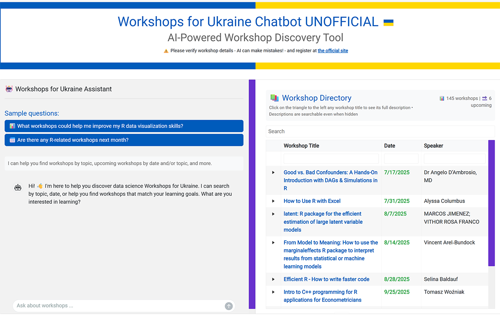

# RAG Comes to the R Tidyverse Shinyapp code

This repo is to accompany my InfoWorld article [How to create your own RAG applications in R](https://www.infoworld.com/article/4020484/generative-ai-rag-comes-to-the-r-tidyverse.html) (July 17, 2025). You'll need to run the code in that article in order to generate data used by the app in order for the app to run on your system.

You also need an [OpenAI key](https://platform.openai.com/api-keys) stored in an `OPENAI_API_KEY` R environment. This is usually as simple as adding `OPENAI_API_KEY='YOUR_API_KEY_HERE'`to an .Renviron file. If you'd prefer to use another provider, including local models via Ollama, you'll need to change the `chat_openai()` and `Sys.getenv("OPENAI_API_KEY")` portions of the code.

This repo contains a Shiny app file, `app.R`. It is for demo purposes to run locally (or deploy to a server where you're willing to pay for all users' API calls).

I published [a similar app on Posit Connect Cloud that you can check out](https://smach-rag-4-ukraine-workshops-demo-app.share.connect.posit.cloud/). It requires you to input your own OpenAI key as I didn't want to pay for everyone's usage 😅 If you don't have a key, you can still see what it looks like and use the searchable table on the right.

Important: There was a strange bug recently when trying to run the app on Windows that has nothing to do with the ragnar package. If you run into 
problems, make sure you have the development version of ellmer, not the CRAN version 
(install it with `pak::pak("tidyverse/ellmer")` ). If you want the CRAN version of ellmer, you can deal with the bug by rolling back your `httr2` R package version to 
version 1.1.1 if you have the 1.1.2. 

You can instal httr2 1.1.1 specifically with      
`remotes::install_version("httr2", version = "1.1.1", repos = "https://cloud.r-project.org")`

Thanks to the Claude Opus LLM for writing most of this Shiny code 😅 and to
Tomasz Kalinowski at Posit for diagnosing the Windows bug - and of course for the ragnar package.

